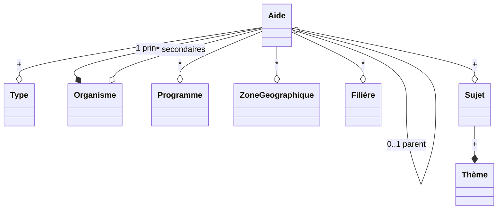

# Aides

## Objectif

Ce module porte les modèles de données représentant les aides aux exploitations agricoles françaises, et fournit les outils nécessaires à l’équipe Aides Agri pour gérer ces aides, de l’intégration à la publication.

## Dépendances internes

Aucune notable.

## Dépendances externes

* Le référentiel du découpage administratif : ce service public numérique (https://geo.api.gouv.fr/decoupage-administratif) expose des jeux de données complets concernant les régions, collectivités d’outre-mer, départements, EPCIs, et communes.

## Modèle de données

Notes :

* L’entité `Aide` est centrale, toutes les autres entités gérées par ce module sont finalement des référentiels qui servent à qualifier des `Aides` ;
* Il y a une structure arborescente concernant les dispositifs d’aides ; elle sert à représenter des dispositifs-chapeaux qui factorisent des informations reprises par des dispositifs concrets (exemples : les Programmes Opérationnels de la PAC, ou des dispositifs nationaux définis par le Ministère mais portés au niveau départemental par les DDT(M)) ;
* L’entité `Aide` contient, en plus des champs nécessaires à sa publication sur le site Aides Agri, un champ dynamique (de type `HStore` de PostgreSQL) qui permet de garder une trace des données brutes présentes lors de l’insertion du dispositif en base, au cas où celle-ci aurait été faite de manière automatisée ;
* L’entité `ZoneGeographique` contient le découpage administratif du territoire français jusqu’au niveau des communes (donc régions/collectivités d’outre-mer/départements/EPCIs/communes) ; cette base est peuplée automatiquement grâce à la commande Django [aides_load_zones_geographiques](management/commands/aides_load_zones_geographiques.py) qui charge les données depuis https://geo.api.gouv.fr/.

## Cycle de vie des aides

États possibles pour l’objet `Aide` :

* `0. Backlog - À prioriser` : on sait que le dispositif existe, il est entré dans notre système sous une forme minimaliste (souvent juste un nom, un organisme porteur) ;
* `1. Priorisée - Scope à vérif` : on a saisi quelques informations permettant de prioriser son intégration (son potentiel en matière de volume financier et de proportion des exploitations agricoles impactées, son impact politique, son degré d’urgence, etc.) ; reste à savoir s’il est pertinent pour notre produit (ce n’est pas forcément la même personne qui est décideur sur ce sujet) ;
* `2. Ok scope - À éditer` : ce dispositif doit être enrichi éditorialement en vue de sa publication sur le site Aides Agri ;
* `3. Ok édito - À valider` : le dispositif a été enrichi, aussi bien sur ses caractéristiques que de manière éditoriale ; il nécessite une validation avant publication ;
* `3.1 En attente validation métier` : la validation avant publication est en attente d’un avis extérieur à l’équipe Aides Agri, une expertise métier par exemple ;
* `4. Publiée sous embargo` : le dispositif est complètement enrichi et validé, mais ne peut pas encore être publié ; si une date de publication est fixée, sa publication sera automatique ;
* `4.1 À décliner` : le dispositif est complètement enrichi et validé, mais n’a pas vocation à être publié : c’est un dispositif-chapeau qui a vocation à être décliné ;
* `5. Publiée` : l’aide est visible sur le site, elle peut apparaître dans les recommandations faites aux utilisatrices et utilisateurs, et est référencée par les moteurs de recherche ;
* `6. Archivée` : le dispositif est exclu, soit temporairement soit définitivement ; la raison doit en être documentée dans un champ de commentaire interne.
